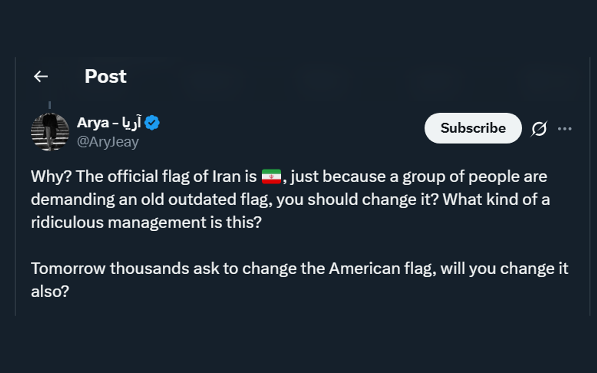
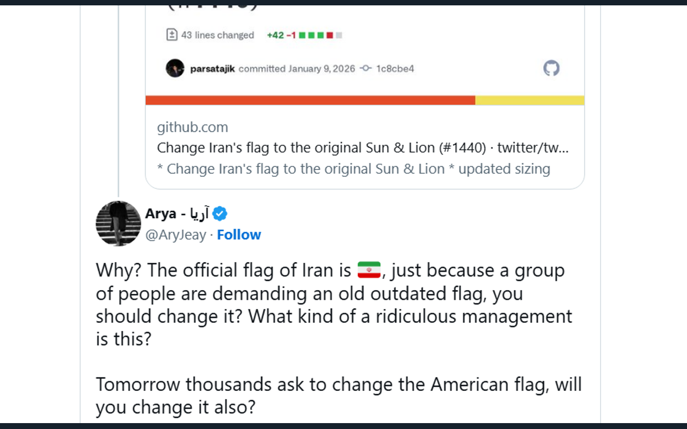

# 🇮🇷 Restore Iran Flag

X (formerly Twitter) changed the Iran flag emoji to a wrong flag without any official request. This browser extension restores the official flag of Iran.





## Install

- **Chrome**: [Chrome Web Store](#)
- **Firefox**: [Firefox Add-ons](#)
- **Edge**: [Edge Add-ons](#)
- **Safari**: Use [Userscripts](https://apps.apple.com/app/userscripts/id1463298887) app
- **Other browsers**: Install the [userscript](userscript/restore-iran-flag.user.js) via Tampermonkey/Violentmonkey

## How it works

The extension monitors Twitter/X pages and replaces the unauthorized flag emoji with the official Iranian flag. It uses a MutationObserver to catch dynamically loaded content.

## Build

```bash
npm install
npm run build
```

Output in `dist/`:
- Landing pages (index.html, index-fa.html, index-ar.html)
- `chrome-extension.zip` for Chrome Web Store
- `firefox-addon.zip` for Firefox Add-ons

## Deploy

Cloudflare Pages:
- Build command: `npm run build`
- Output directory: `dist`

## Project structure

```
├── chrome-extension/    # Chrome extension (Manifest V3)
├── firefox-addon/       # Firefox add-on (Manifest V2)
├── userscript/          # Userscript for Tampermonkey/Violentmonkey
├── template.html        # Landing page template (Mustache)
├── data.json            # Translations and config
└── build.cjs            # Build script
```
